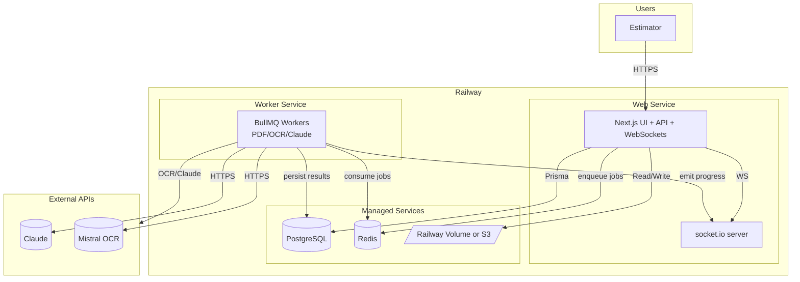

### C4 Model – Level 2: Container (Planned Railway Deployment)

Based on `DEPLOYMENT.md`.

```mermaid
flowchart TB
  subgraph Users[Users]
    U[Estimator]
  end

  subgraph Railway[Railway]
    subgraph Web[Web Service]
      Next[Next.js UI + API + WebSockets]
      SocketIO[socket.io server]
    end
    subgraph Worker[Worker Service]
      BullWorker[BullMQ Workers\nPDF/OCR/Claude]
    end
    subgraph Managed[Managed Services]
      PG[(PostgreSQL)]
      Redis[(Redis)]
      Volume[/Railway Volume or S3/]
    end
  end

  U -- HTTPS --> Next
  Next -- WS --> SocketIO
  Next -- Prisma --> PG
  Next -- Read/Write --> Volume
  Next -- enqueue jobs --> Redis
  BullWorker -- consume jobs --> Redis
  BullWorker -- OCR/Claude --> ExternalAPIs
  BullWorker -- persist results --> PG
  BullWorker -- emit progress --> SocketIO

  subgraph ExternalAPIs[External APIs]
    Claude[(Claude)]
    Mistral[(Mistral OCR)]
  end

  BullWorker -- HTTPS --> Claude
  BullWorker -- HTTPS --> Mistral
```

