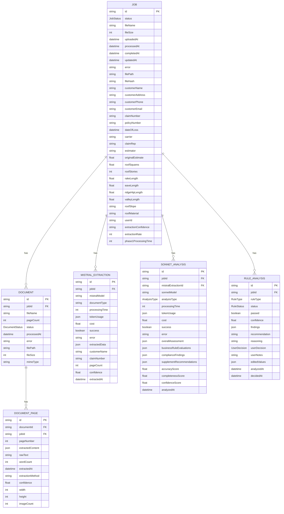

### ERD – Based on prisma/schema.prisma

Notes:
- Field nullability simplified for readability. Refer to `prisma/schema.prisma` for exact constraints and indexes (e.g., `@@unique([documentId, pageNumber])`).

