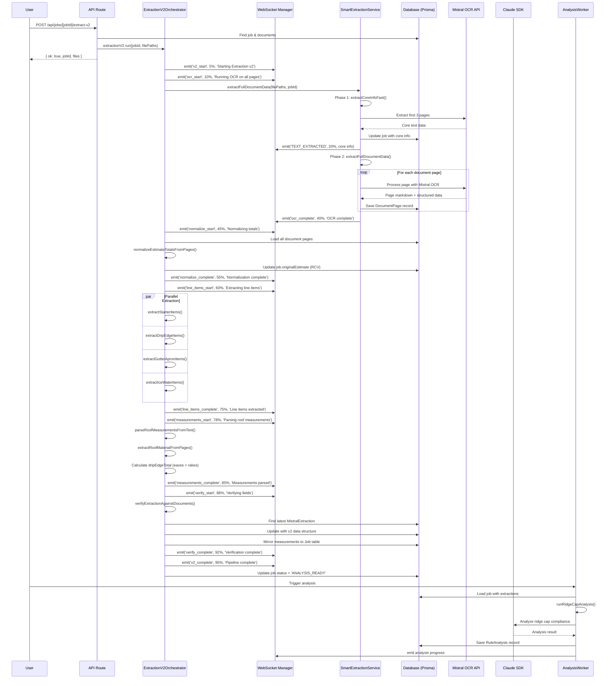
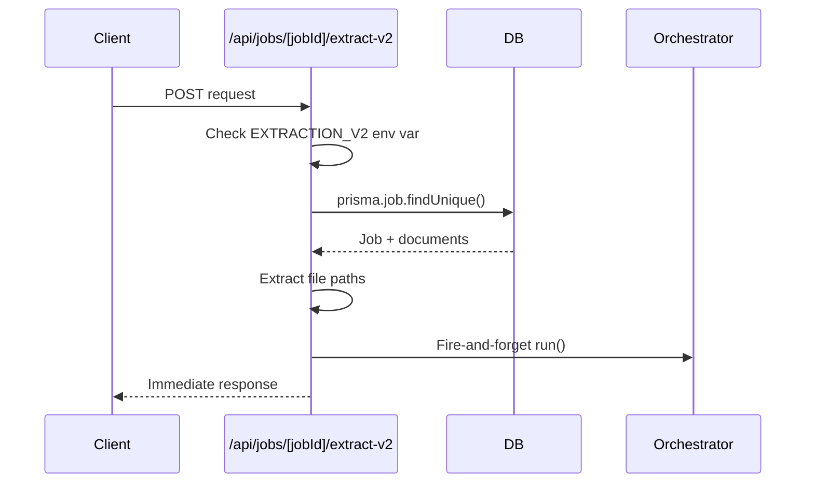
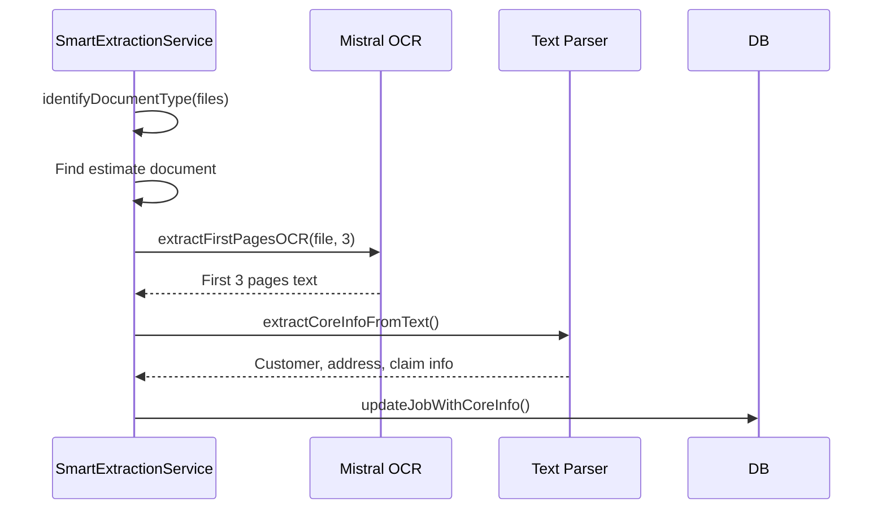
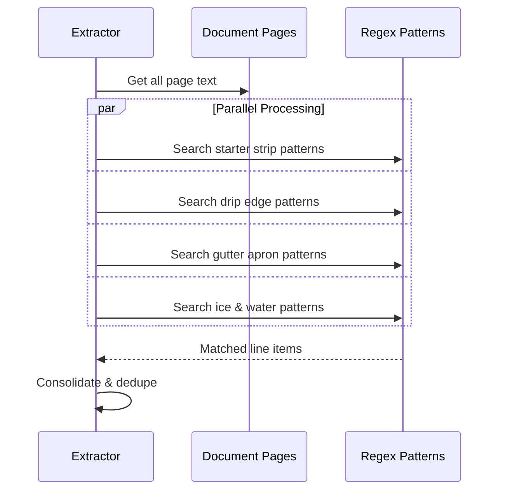
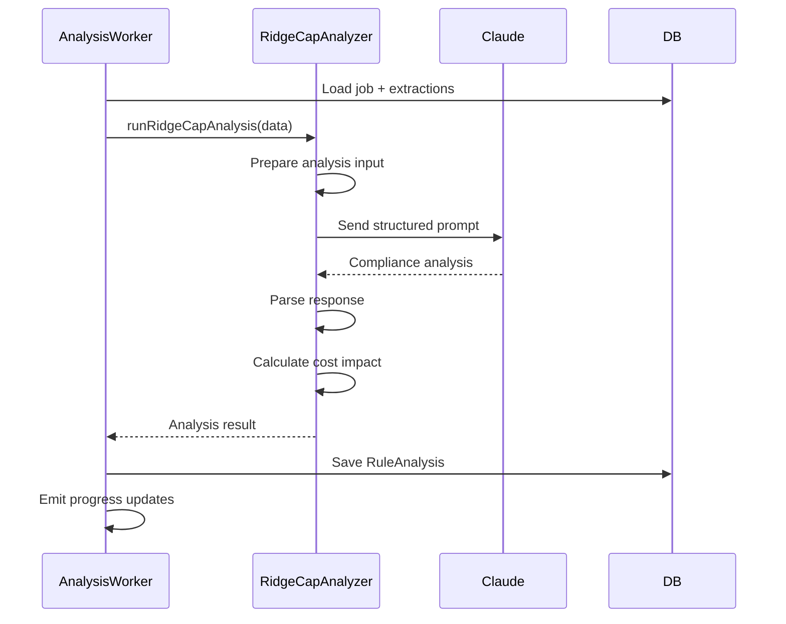
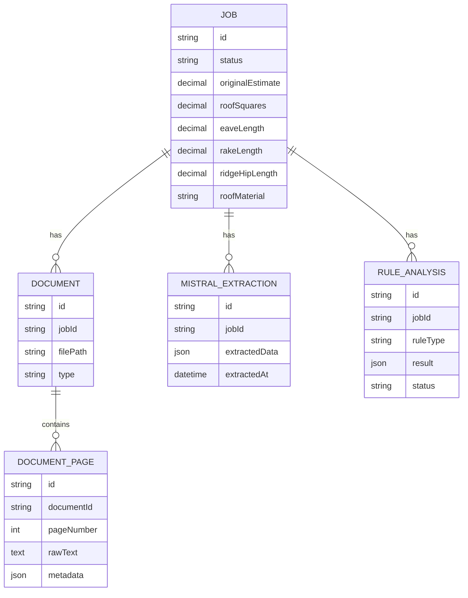
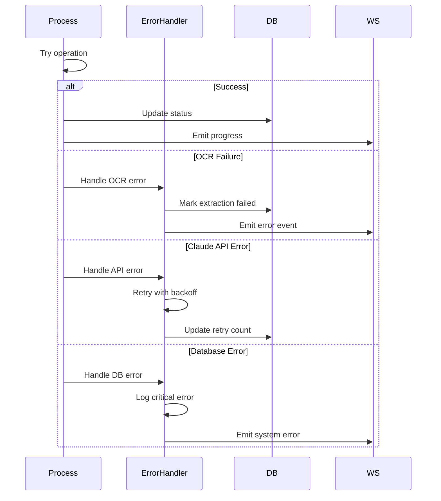

# Document Processing Sequence Diagram

## High-Level Architecture Flow



## Detailed Component Interactions

### 1. API Route Handler Flow


### 2. Smart Extraction Service - Phase 1 (Fast Core Info)


### 3. Line Item Extraction Flow


### 4. Business Rule Analysis Flow


## Data Flow & Storage

### Database Schema Relationships


## V2 Data Structure

### MistralExtraction.extractedData Structure
```javascript
{
  // Original extraction data
  customerName: "...",
  propertyAddress: "...",
  // ... other fields
  
  // V2 enhanced data
  v2: {
    totals: {
      rcv: 25000.00,
      acv: 22000.00,
      netClaim: 21500.00,
      priceList: "RFG_JUL24",
      estimateCompletedAt: "2024-07-15"
    },
    lineItems: [
      {
        code: "RF HIP RDG",
        description: "Hip/Ridge Cap - Standard",
        quantity: "72.78 LF",
        unit: "LF",
        unitPrice: 2.50,
        total: 181.95,
        category: "ridge_hip",
        pageNumber: 5,
        confidence: 0.95
      }
      // ... more items
    ],
    measurements: {
      squares: 32.5,
      stories: 2,
      pitch: "8/12",
      eaveLength: 145.2,
      rakeLength: 98.6,
      ridgeLength: 72.78,
      hipLength: 0,
      totalRidgeHip: 72.78,
      dripEdgeTotal: 243.8,  // Derived: eaves + rakes
      valleyLength: 45.3,
      material: "Composition Shingle"
    },
    verification: {
      documentMatches: true,
      confidence: 0.92,
      discrepancies: []
    }
  }
}
```

## Error Handling & Recovery



## Performance Optimizations

### Parallel Processing Points
1. **Document Type Identification**: All files processed in parallel
2. **Line Item Extraction**: All categories extracted simultaneously
3. **Page OCR**: Batch processing with concurrent API calls (limited by rate limits)

### Caching Strategy
- OCR results cached in DocumentPage table
- Extraction results persisted in MistralExtraction
- Business rule analyses stored in RuleAnalysis table
- No reprocessing unless explicitly requested

### Progressive Loading
1. **Immediate** (< 5s): Job creation, initial status
2. **Fast** (30-60s): Core info from first 3 pages
3. **Standard** (2-3min): Full OCR and extraction
4. **Complete** (3-5min): All business rules analyzed

## WebSocket Events

### Event Flow Timeline
```
[0s]    job:created
[5s]    v2_start (5%)
[10s]   ocr_start (10%)
[20s]   TEXT_EXTRACTED (20%) - Core info available
[60s]   ocr_complete (40%)
[65s]   normalize_start (45%)
[70s]   normalize_complete (55%)
[75s]   line_items_start (60%)
[90s]   line_items_complete (75%)
[95s]   measurements_start (78%)
[100s]  measurements_complete (85%)
[105s]  verify_start (88%)
[110s]  verify_complete (92%)
[115s]  v2_complete (95%)
[120s]  job:analysis_ready (100%)
```

## Key Integration Points

### 1. Mistral OCR API
- **Endpoint**: `/v1/ocr`
- **Model**: `mistral-ocr-2505`
- **Cost**: ~$0.02 per document
- **Timeout**: 30s per page

### 2. Claude SDK
- **Model**: `claude-3-haiku` (fast analysis)
- **Fallback**: `claude-3-sonnet` (complex cases)
- **Rate Limits**: 50 req/min
- **Context Window**: 200k tokens

### 3. Database Transactions
- Atomic updates for extraction results
- Optimistic locking for concurrent access
- Batch inserts for page data

### 4. WebSocket Manager
- Room-based broadcasting (per job)
- Automatic reconnection handling
- Message queuing for offline clients