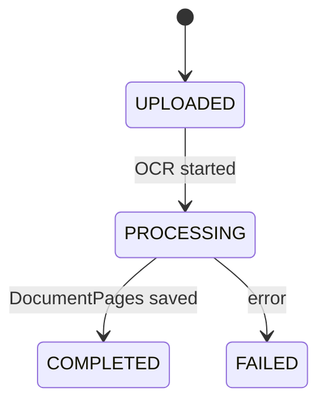

### State Machine – Document Lifecycle

```mermaid
stateDiagram-v2
  [*] --> UPLOADED
  UPLOADED --> PROCESSING: OCR started
  PROCESSING --> COMPLETED: DocumentPages saved
  PROCESSING --> FAILED: error
```

Notes:
- `Document.status` set in `/api/upload` and updated during OCR persistence in `SmartExtractionService.savePageContentToDatabase`.

